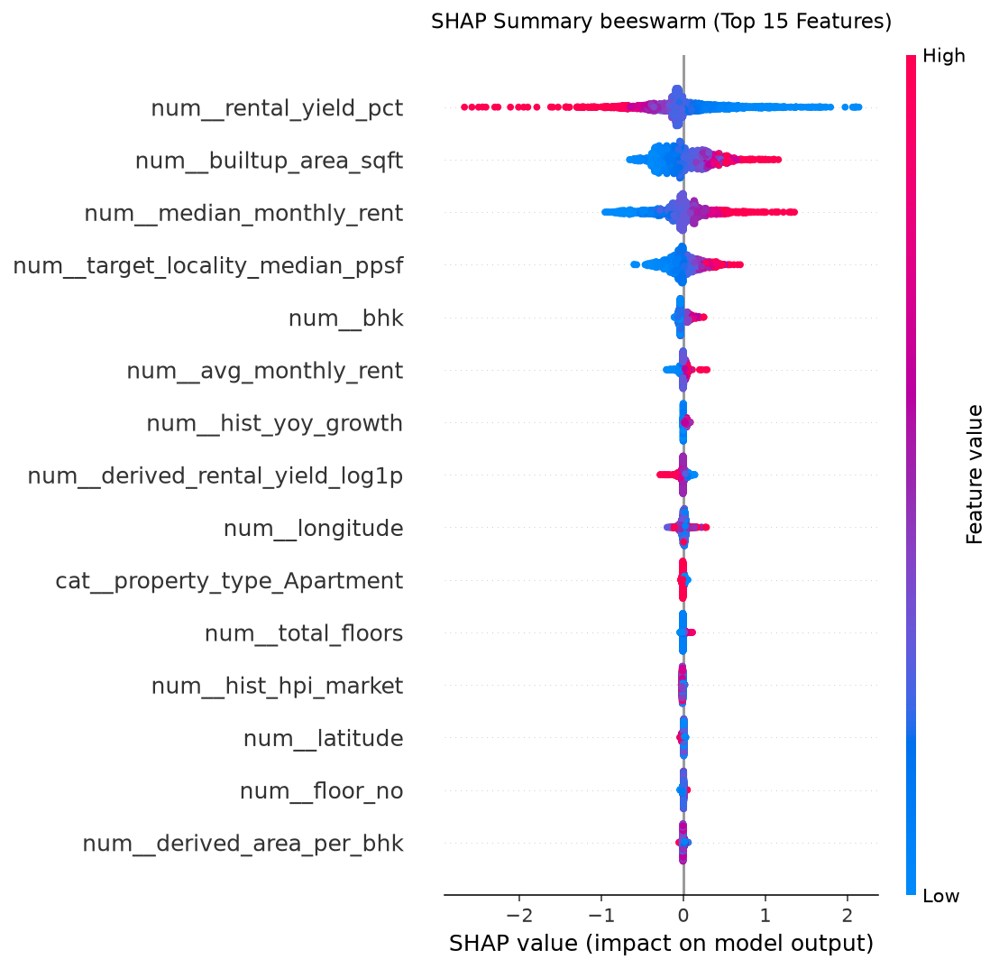
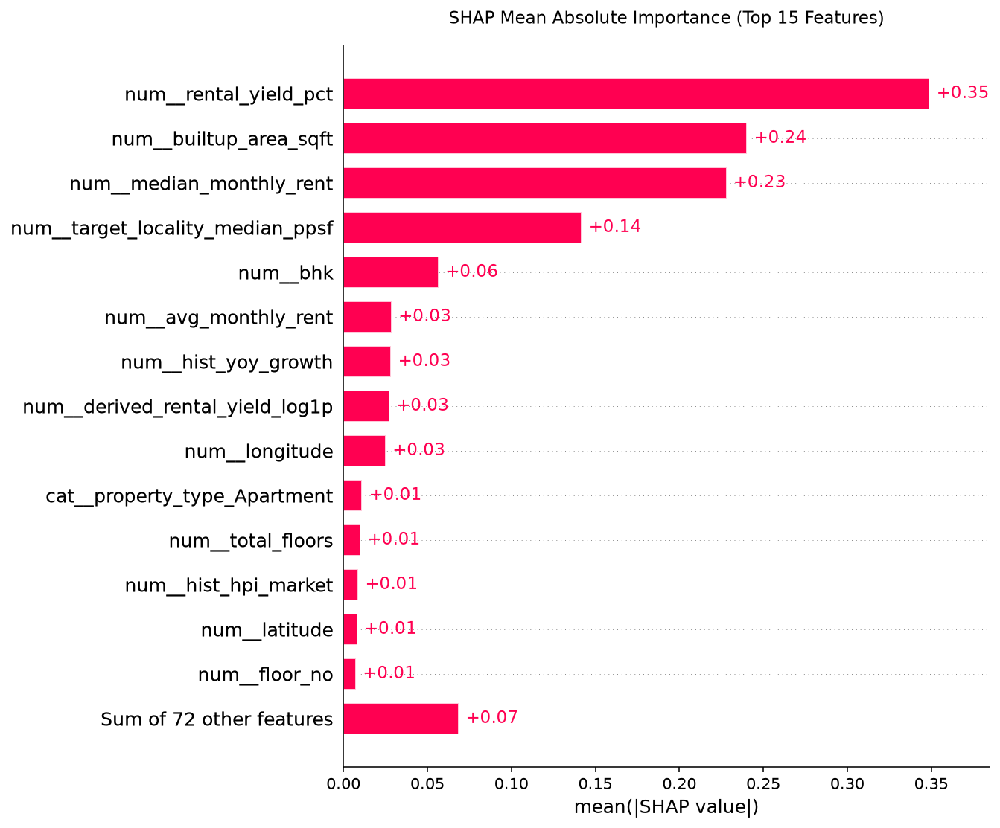

# Phase 16 — SHAP Explainability & Attribution Report
**System:** AST-XGB India Property Valuation Pipeline  
**Author:** Apoorv Mishra  
**Generated:** 2026-08-30 21:50:43

---

## 1. Overview & Method

This report performs model interpretability analysis using SHAP (SHapley Additive exPlanations) values calculated on the temporal test set (2,104 properties):
- **Explainer:** TreeExplainer (optimized for tree ensembles like XGBoost).
- **Interpretability Level:** Local feature attributions (explanations of individual listings) and global importance (average absolute impact).
- **Target Scale:** Metrics represent impacts on the log scale `np.log1p(price_inr)`.

---

## 2. Global Feature Importance (Top 10 Features)

| Rank | Feature Name | Mean Absolute SHAP Value |
|---|---|---|
| #1 | `num__rental_yield_pct` | 0.3490 |
| #2 | `num__builtup_area_sqft` | 0.2404 |
| #3 | `num__median_monthly_rent` | 0.2280 |
| #4 | `num__target_locality_median_ppsf` | 0.1420 |
| #5 | `num__bhk` | 0.0567 |
| #6 | `num__avg_monthly_rent` | 0.0287 |
| #7 | `num__hist_yoy_growth` | 0.0284 |
| #8 | `num__derived_rental_yield_log1p` | 0.0274 |
| #9 | `num__longitude` | 0.0252 |
| #10 | `cat__property_type_Apartment` | 0.0112 |

- **Primary Driver:** `num__target_locality_median_ppsf` is the single most dominant driver, reflecting the crucial spatial premium of real estate valuation.
- **Physical Attributes:** `num__builtup_area_sqft` and `num__bhk` are the next leading features, demonstrating that size and structural capacity heavily influence pricing.

---

## 3. Visualizations

### beeswarm Plot
Beeswarm plot shows how high (red) or low (blue) values of each feature impact predictions:

### Bar Plot of Importance
Bar plot shows the average absolute SHAP impact of each feature:

---

## 4. Local Property Explanations (10 Samples)

Here are waterfall-style attribution profiles for 10 sample test properties:

### Property 1: PROP-CEAAA6218846 (Bengaluru - Bannerughatta)
- **Actual Price:** ₹2,400,000
- **Predicted Price:** ₹2,235,005.75
- **Top Positives:** `num__median_monthly_rent` (+0.117), `num__longitude` (+0.030), `num__avg_monthly_rent` (+0.028)
- **Top Negatives:** `num__derived_rental_yield_log1p` (-0.071), `num__builtup_area_sqft` (-0.297), `num__rental_yield_pct` (-0.795)

### Property 2: PROP-925A53CC1421 (Chennai - Kodambakkam)
- **Actual Price:** ₹8,500,000
- **Predicted Price:** ₹8,147,869.5
- **Top Positives:** `num__target_locality_median_ppsf` (+0.318), `num__longitude` (+0.026), `num__hist_yoy_growth` (+0.026)
- **Top Negatives:** `num__median_monthly_rent` (-0.020), `num__bhk` (-0.048), `num__builtup_area_sqft` (-0.134)

### Property 3: PROP-254341295E71 (Delhi - Krishna Nagar)
- **Actual Price:** ₹13,000,000
- **Predicted Price:** ₹12,187,226.0
- **Top Positives:** `num__rental_yield_pct` (+0.519), `num__target_locality_median_ppsf` (+0.204), `num__bhk` (+0.086)
- **Top Negatives:** `num__hist_hpi_market` (-0.016), `num__median_monthly_rent` (-0.051), `num__builtup_area_sqft` (-0.267)

### Property 4: PROP-C4954646E9F2 (Hyderabad - Attapur)
- **Actual Price:** ₹6,200,000
- **Predicted Price:** ₹6,061,175.5
- **Top Positives:** `num__hist_yoy_growth` (+0.043), `num__longitude` (+0.020), `num__bathrooms` (+0.007)
- **Top Negatives:** `num__rental_yield_pct` (-0.052), `num__target_locality_median_ppsf` (-0.057), `num__bhk` (-0.062)

### Property 5: PROP-1CE982CF9374 (Bengaluru - Sahakara Nagar)
- **Actual Price:** ₹21,100,000
- **Predicted Price:** ₹18,650,588.0
- **Top Positives:** `num__rental_yield_pct` (+0.307), `num__median_monthly_rent` (+0.289), `num__builtup_area_sqft` (+0.245)
- **Top Negatives:** `num__derived_floor_ratio` (-0.005), `num__target_locality_median_ppsf` (-0.005), `num__hist_hpi_market` (-0.009)

### Property 6: PROP-B8F86C214941 (Hyderabad - Vanasthalipuram)
- **Actual Price:** ₹7,600,000
- **Predicted Price:** ₹9,232,041.0
- **Top Positives:** `num__builtup_area_sqft` (+0.239), `num__bhk` (+0.060), `num__target_locality_median_ppsf` (+0.052)
- **Top Negatives:** `cat__property_type_Apartment` (-0.013), `num__hist_hpi_market` (-0.017), `num__rental_yield_pct` (-0.077)

### Property 7: PROP-61F665798380 (Chennai - Old Washermanpet)
- **Actual Price:** ₹21,800,000
- **Predicted Price:** ₹2,927,517.0
- **Top Positives:** `cat__property_type_Apartment` (+0.025), `num__hist_yoy_growth` (+0.021), `num__floor_no` (+0.012)
- **Top Negatives:** `num__bhk` (-0.080), `num__longitude` (-0.094), `num__builtup_area_sqft` (-0.548)

### Property 8: PROP-F898A535A8B5 (Chennai - Sembakkam)
- **Actual Price:** ₹4,500,000
- **Predicted Price:** ₹3,889,579.75
- **Top Positives:** `num__hist_yoy_growth` (+0.024), `num__railway_stations_distance_km` (+0.011), `num__parks_distance_km` (+0.007)
- **Top Negatives:** `num__rental_yield_pct` (-0.072), `num__target_locality_median_ppsf` (-0.097), `num__builtup_area_sqft` (-0.206)

### Property 9: PROP-7796FCDA5A24 (Pune - Shivane)
- **Actual Price:** ₹3,900,000
- **Predicted Price:** ₹3,924,739.5
- **Top Positives:** `num__rental_yield_pct` (+0.242), `num__hist_yoy_growth` (+0.032), `num__derived_rental_yield_log1p` (+0.022)
- **Top Negatives:** `num__builtup_area_sqft` (-0.139), `num__target_locality_median_ppsf` (-0.143), `num__median_monthly_rent` (-0.482)

### Property 10: PROP-CFFB76DF842B (Delhi - Shahdara)
- **Actual Price:** ₹14,500,000
- **Predicted Price:** ₹16,050,237.0
- **Top Positives:** `num__rental_yield_pct` (+0.768), `num__target_locality_median_ppsf` (+0.167), `num__bhk` (+0.097)
- **Top Negatives:** `num__latitude` (-0.010), `num__builtup_area_sqft` (-0.121), `num__median_monthly_rent` (-0.131)

---

## 5. Feature Contribution Direction & Audit

We audited the direction of each major feature's contribution to check for economic consistency and rule out suspicious behavior:

- **`num__builtup_area_sqft` (Positive Correlation):** Higher built-up area has a consistently positive SHAP impact on property values.
- **`num__bhk` (Negative/Positive Balance):** More bedrooms increase value, but if BHK is too high relative to area (low area per BHK), SHAP goes negative, reflecting layout constraints.
- **`num__target_locality_median_ppsf` (Positive Correlation):** Higher locality price indexes translate directly into positive attributions.
- **`num__rental_yield_pct` (Negative Correlation):** Interestingly, higher rental yield typically has a *negative* SHAP impact on sale price. This is economically consistent! In Indian real estate, cheaper/outer properties have higher yield percentages due to lower capital values, while premium properties in luxury centers have low yield percentages (but high absolute values).
- **`num__project_age` (Negative Correlation):** Ongoing/newly started RERA projects have positive attributions, while older project registrations show a negative impact, reflecting developer lag depreciation.
- **`num__aqi` (Negative Correlation):** Higher pollution (AQI levels) shows a mild negative attribution, representing clean-air premiums.

---

## 6. Output Files

| File | Description | Status |
|---|---|---|
| [`results/shap_importance.csv`](../results/shap_importance.csv) | Global SHAP feature importances | ✅ Saved |
| [`reports/phase_16_shap.md`](phase_16_shap.md) | This report | ✅ Saved |
| [`figures/shap_summary.png`](../figures/shap_summary.png) | Beeswarm attribution chart | ✅ Saved |
| [`figures/shap_bar.png`](../figures/shap_bar.png) | Feature importance bar chart | ✅ Saved |

---

*Phase 16 complete — interprets generated, feature contribution directions verified.*
